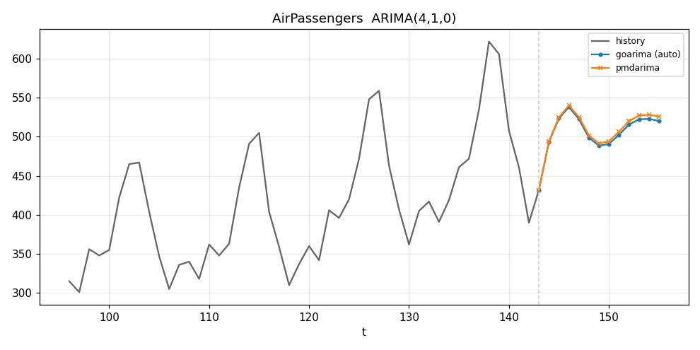
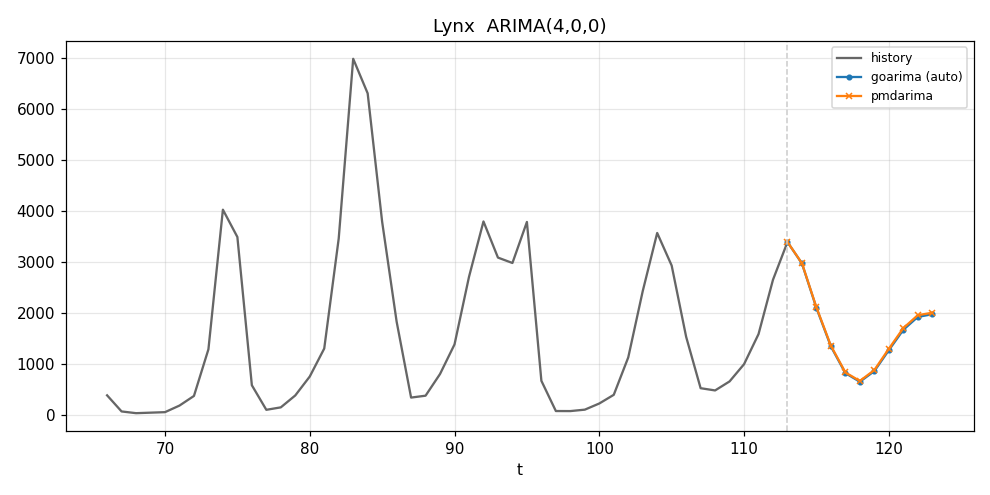
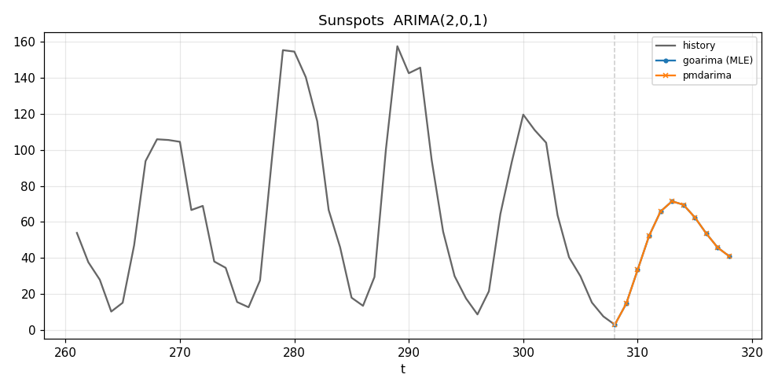
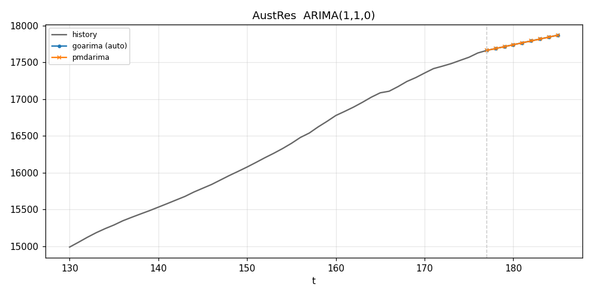
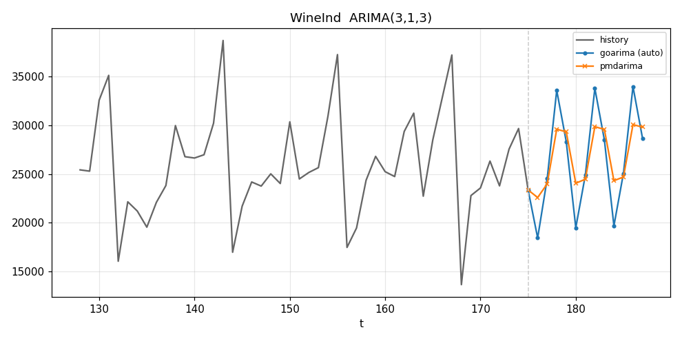
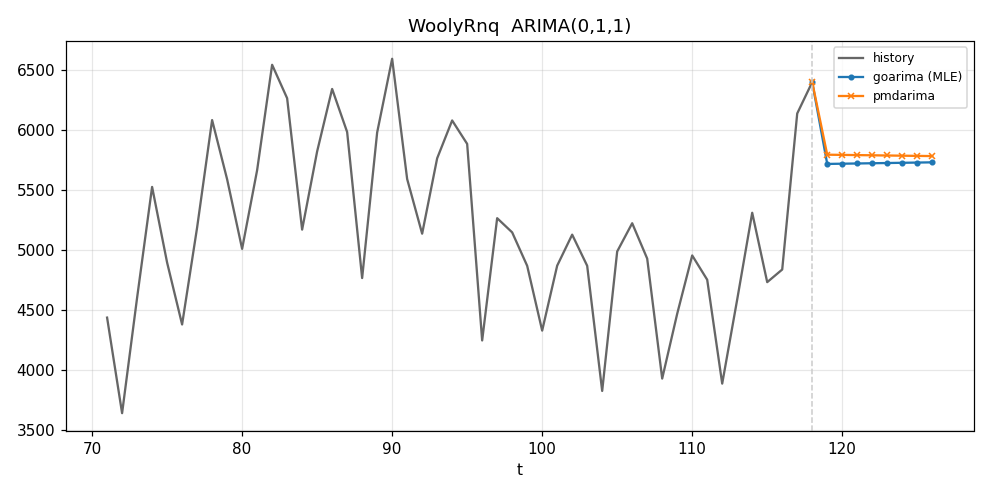
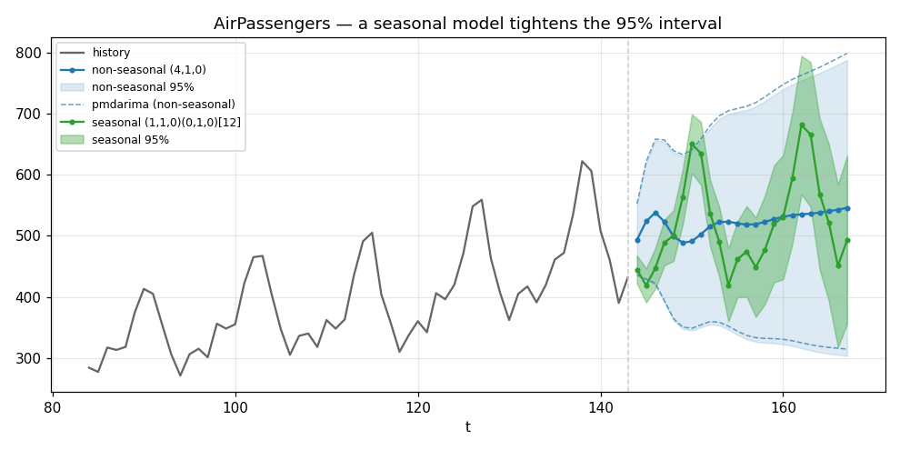
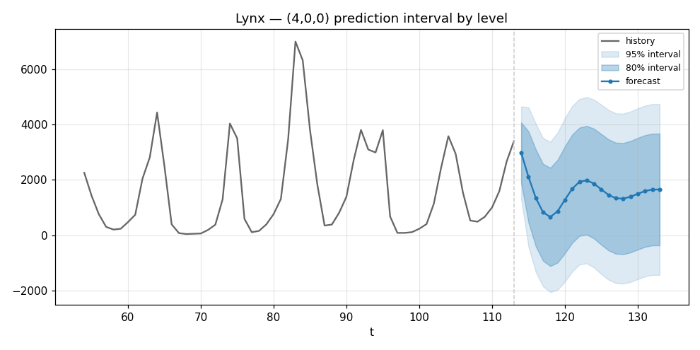
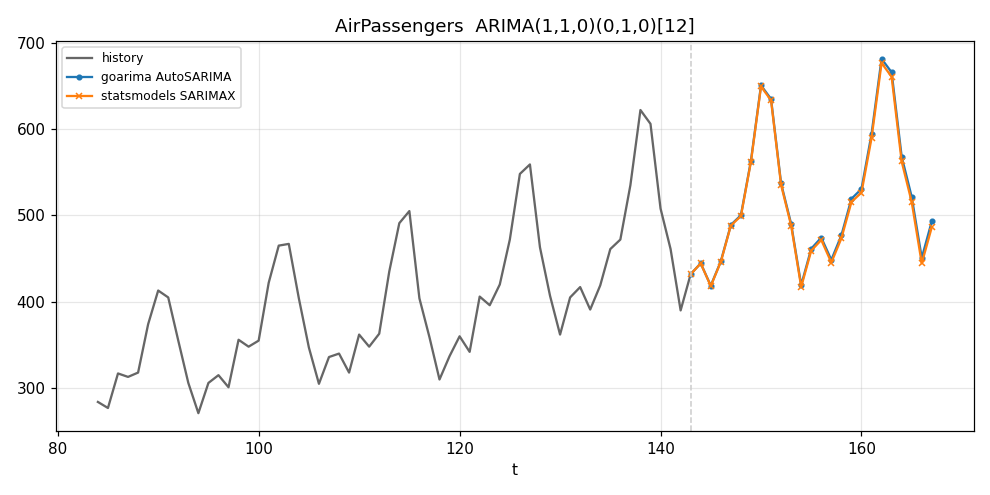
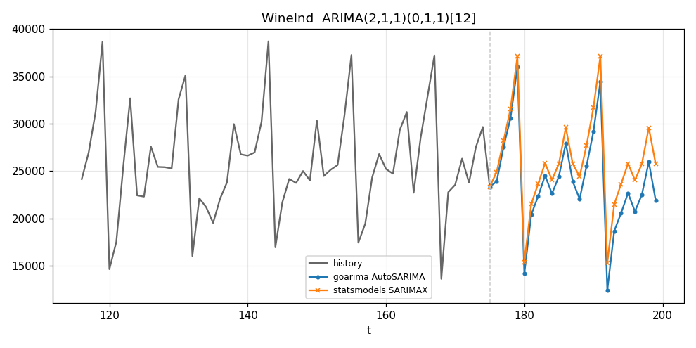

# Forecasting examples

Worked examples of goarima on classic datasets, each compared against a
maximum-likelihood reference at the same orders:

- **ARIMA (non-seasonal)** — `AutoARIMA` vs [pmdarima](https://alkaline-ml.com/pmdarima/).
- **Prediction intervals** — `ForecastInterval` confidence bands vs pmdarima's.
- **Seasonal differencing (SARIMAX)** — `AutoSARIMA` vs statsmodels **SARIMAX**.

In every chart the grey line is the observed history, the dashed line marks the
last observation, and the two coloured lines are the forecasts continuing from it.
All orders are goarima's *automatic* choices, not hard-coded.

## How these were generated

1. `example/main.go` runs `AutoARIMA` (and `AutoSARIMA`) on each series and prints
   a `[goarima] <name> ARIMA(p,d,q)` block — and, for the seasonal datasets, a
   `[goarima-seasonal] <name> ARIMA(p,d,q)(P,D,Q)[m]` block — with the forecast.
2. `example/plot_compare.py`, `example/plot_interval.py`, and
   `example/plot_seasonal.py` parse those blocks, fit the reference (pmdarima /
   statsmodels SARIMAX) at the same orders, and plot each series' history with both
   forecasts (and, for `plot_interval.py`, the prediction bands).

Regenerate the charts (needs the `example/env` venv) with:

```sh
make charts            # runs plot_compare.py then plot_seasonal.py
```

Charts are written to the gitignored `example/charts/`; the committed copies below
live under `docs/images/`.

---

## ARIMA (non-seasonal)

`AutoARIMA` chooses `d` with a KPSS stationarity test, then searches `p` and `q`
to minimize an information criterion (AIC by default). Both goarima and pmdarima
are fitted with exact MLE here, so the AR/MA terms goarima picks let the two
forecasts follow each series' shape together.

```go
series, _ := /* example/data/<name>.csv */
model, _ := goarima.AutoARIMA(series, 5, 2, 5) // maxP, maxD, maxQ
forecast, _ := model.Forecast(horizon)
```

The orders `AutoARIMA` selected for each dataset (within `maxP=maxQ=5`, `maxD=2`):

| Dataset | Selected order | Horizon |
|---|---|---|
| AirPassengers | ARIMA(4,1,0) | 12 |
| Lynx | ARIMA(4,0,0) | 10 |
| WineInd | ARIMA(3,1,3) | 12 |
| Sunspots | ARIMA(4,1,4) | 10 |
| WoolyRnq | ARIMA(3,1,3) | 8 |
| AustRes | ARIMA(1,1,0) | 8 |

| AirPassengers — ARIMA(4,1,0) | Lynx — ARIMA(4,0,0) |
|---|---|
|  |  |

| Sunspots — ARIMA(4,1,4) | AustRes — ARIMA(1,1,0) |
|---|---|
|  |  |

| WineInd — ARIMA(3,1,3) | WoolyRnq — ARIMA(3,1,3) |
|---|---|
|  |  |

Lynx (`d=0`) decays toward its mean, as a stationary AR forecast should. For the
seasonal series (AirPassengers, WineInd, WoolyRnq), a *non-seasonal* ARIMA only
partially captures the yearly cycle — which is exactly what seasonal differencing
fixes below.

---

## Prediction intervals

`ForecastInterval` returns the point forecast with a confidence band. The forecast
variance comes from the model's MA(∞) representation, `Var(k) = σ²·Σψ²` (so the
band widens with the horizon), and the bounds are `forecast ± z·√Var(k)`:

```go
series, _ := /* example/data/<name>.csv */
model, _ := goarima.AutoARIMA(series, 5, 2, 5)
fc, _ := model.ForecastInterval(horizon, 0.95) // horizon, confidence level
// fc.Point, fc.Lower, fc.Upper, fc.StdErr
```

A wide band is not a defect — it is the model honestly reporting its uncertainty,
and the widths match [pmdarima](https://alkaline-ml.com/pmdarima/) / statsmodels
(verified in the integration tests). So a band is tightened *legitimately* only by
changing the question or improving the fit, never by shrinking a calibrated
interval. The two charts below show the two levers.

### Lever 1 — fit the structure (smaller σ² ⇒ tighter band)

A non-seasonal `ARIMA(4,1,0)` on AirPassengers leaves the entire 12-month cycle in
its residuals, so σ² — and the band — are large. Switching to `AutoSARIMA`, which
takes a seasonal difference, drops σ² roughly **6×** (884 → 137) and the band with
it, while the forecast finally follows the yearly peaks:



The light band is the non-seasonal 95% interval; the dashed lines are pmdarima at
the same non-seasonal order — they coincide, confirming the wide band is real, not
a goarima artefact. The green band is the seasonal model's 95% interval, far
tighter and centred on the actual cycle.

```go
// wide band: non-seasonal
ns, _ := goarima.AutoARIMA(series, 5, 2, 5)              // ARIMA(4,1,0)
// tight band: model the seasonality
se, _ := goarima.AutoSARIMA(series, 3, 1, 3, 12)         // ARIMA(1,1,0)(0,1,0)[12]
fc, _ := se.ForecastInterval(24, 0.95)
```

### Lever 2 — ask for a lower confidence level

A less conservative level uses a smaller `z` (1.28 for 80% vs 1.96 for 95%), so the
band narrows by about a third. On the stationary Lynx series (`d=0`) the bands also
settle toward constant width as the AR forecast decays to the mean:



```go
model, _ := goarima.AutoARIMA(series, 5, 2, 5)           // ARIMA(4,0,0)
narrow, _ := model.ForecastInterval(20, 0.80)
wide, _   := model.ForecastInterval(20, 0.95)
```

(For series whose variance grows with their level, a variance-stabilizing
transform — fit `log(series)`, then exponentiate the point and bounds — also keeps
the band proportional and the lower bound positive. It helps only alongside a
well-fitting model, though: a log transform on a *non-seasonal* AirPassengers fit
still misses the cycle and does not tighten the band.)

---

## Seasonal differencing (SARIMAX)

These two strongly seasonal monthly series take a seasonal difference (`D = 1`,
`m = 12`), so the forecasts reproduce the yearly cycle that the non-seasonal fits
above flatten. The reference here is statsmodels' **SARIMAX** (Seasonal ARIMA with
eXogenous regressors).

### AirPassengers — ARIMA(1,1,0)(0,1,0)[12]

Monthly international airline passengers (1949–1960): a rising trend with a strong
12-month cycle that grows in amplitude.



**goarima:**

```go
series, _ := /* example/data/airpassengers.csv */
model, _ := goarima.AutoSARIMA(series, 3, 1, 3, 12) // maxP, maxD, maxQ, m
forecast, _ := model.Forecast(24)
// selected: ARIMA(1,1,0)(0,1,0)[12]
```

`AutoSARIMA` picked one ordinary difference (`d = 1`, KPSS) and one seasonal
difference (`D = 1`, the seasonal-strength test), then a single AR term.

**statsmodels SARIMAX reference** (the orange line):

```python
SARIMAX(series, order=(1, 1, 0), seasonal_order=(0, 1, 0, 12),
        enforce_stationarity=False, enforce_invertibility=False).fit()
```

The two forecasts are nearly identical — both follow the seasonal peaks and the
upward trend.

### WineInd — ARIMA(2,1,1)(0,1,0)[12]

Monthly Australian wine sales: a sharper, noisier 12-month cycle.



**goarima:**

```go
series, _ := /* example/data/wineind.csv */
model, _ := goarima.AutoSARIMA(series, 3, 1, 3, 12) // maxP, maxD, maxQ, m
forecast, _ := model.Forecast(24)
// selected: ARIMA(2,1,1)(0,1,0)[12]
```

Here the search added two AR terms and one MA term on top of the same
`(d=1, D=1, m=12)` differencing.

**statsmodels SARIMAX reference:**

```python
SARIMAX(series, order=(2, 1, 1), seasonal_order=(0, 1, 0, 12),
        enforce_stationarity=False, enforce_invertibility=False).fit()
```

Both forecasts track the seasonal swings closely; the small gaps come from the
different estimators (goarima's Hannan-Rissanen seed + drift vs SARIMAX's exact
likelihood) — the same drift difference documented in the integration tests.

---

> **Note on scope.** goarima implements seasonal *differencing*
> `(p, d, q)(0, D, 0)ₘ`. The multiplicative seasonal AR/MA polynomials (`P`, `Q`)
> are a later phase; see [`docs/arima.md`](arima.md) §7 for the details.
